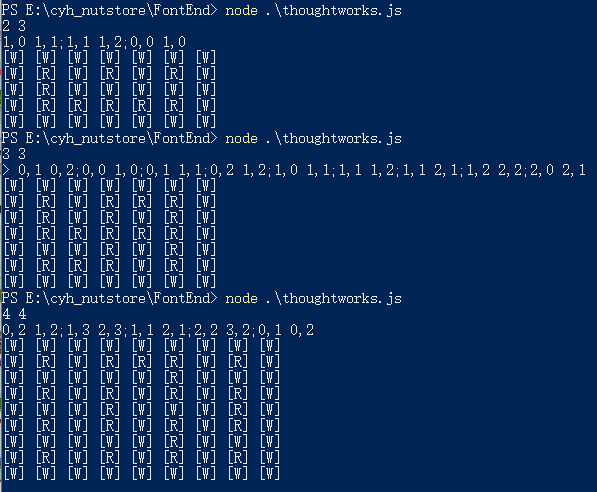
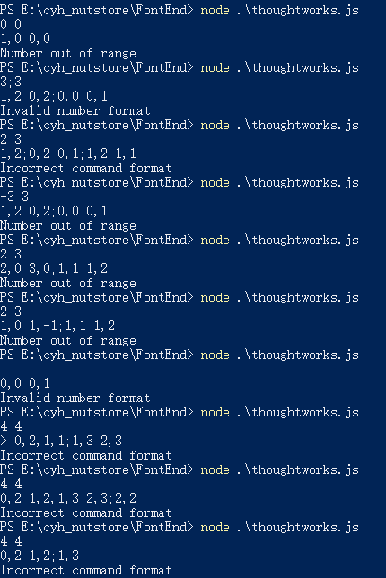
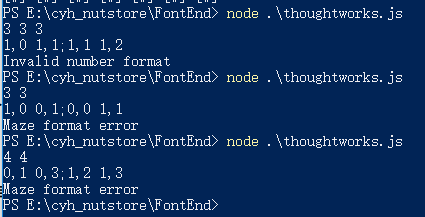
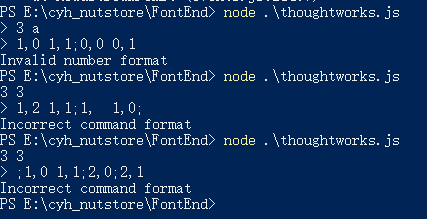
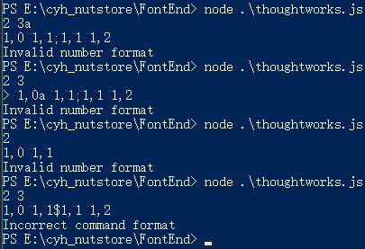

# Thoughtworks Q3--javascript

## 代码思路
### 输入分析
1. 必须为整数
2. 格式必须正确，比如下面示例：

        3 3
        0,1 0,2;0,0 1,0;0,1 1,1;0,2 1,2;1,0 1,1;1,1 1,2;1,1 2,1;1,2 2,2;2,0 2,1

### 代码的构造
1. 首先分析输入，将所有的输入进行切分成迷宫大小以及坐标对的格式(x1,y1,x2,y2),将输入的迷宫大小对应成渲染网格的大小(matrixRow,matrixCol);
2. 然后根据渲染网格大小将初始矩阵绘制出来，保存在outputTemp二维数组中
   + 坐标下标是奇数时是通道，偶数时是墙壁
   + [R][W]中间用空格分离，所以每个[R]或者[W]后面都多加一个空格
3. 接下来根据输入的坐标对进行修改矩阵outputTemp
   + 首先分离坐标对，每组坐标存储到(x1,y1,x2,y2)
   + 然后判断该种联通情况是x轴相等还是y轴相等
   + 如果x轴相等，y轴相差1，那么就在较小的y轴坐标后面替换原来的'[W] '变为'[R] '
   + 如果y轴相等，x轴相差1，那么就在较小的x轴坐标下面替换原来的'[W] '变为'[R] '
4. 最后输出矩阵
    + 由于outputTemp是以矩阵形式保存，直接输出外面会有[]，还有中间的[w]或者[R]会以字符串输出
    + 所以对outputTemp进行数组遍历，每次修改其中的一行，修改完后存储到新建的全局二维数组outputResult中
    + 最后将二维数组outputResult输出，修正一下格式即可
    
5. 提示信息，在运行代码后给出提示输入信息

        console.log('请按照格式输入迷宫大小以及连接cell坐标，运行结束后请按Ctrl+c结束,坐标对末尾不可以有分号');
    
## 异常考虑
### 考虑异常Invalid number format
> 将所有输入都拆分成字符或者数字，然后使用下面函数判断，是否能被parseInt转换为数字

    //一方面考虑字符串开头的情况，另外用isNaN判断‘3a’这种经过parseInt后还是number类型的情况
    //parseInt(input).toString()!=input来判断输入是否为浮点数
    function checkNumber(input) {
        if(parseInt(input).toString()=='NaN' || parseInt(input).toString()!=input) {
            return true;
        }else if(isNaN(input)){
            return true;
        }else {
            return false;
        }
    }
### 考虑异常Number out of range
> 对于迷宫的大小，需要验证是否为正数

> 对于连接迷宫的坐标，需要验证是否为大于等于0的数字，还有需要验证坐标是否大于渲染网格的大小

    if(matrixSize[0]<=0 || matrixSize[1]<=0)
    if(x1>=matrixSize[0] || x2>=matrixSize[0] || y1>=matrixSize[1] || y2>=matrixSize[1] || x1<0 || x2<0 || y1<0 || y2<0)

### 考虑异常Maze format error
>对于无法联通，只允许正南正北正东正西，这样来看，要联通的两个cell必定是要么x轴坐标相等，y轴差1，或者y轴坐标相等，x轴差1

    if((Math.abs(x1-x2)+Math.abs(y1-y2)) == 1)
    除了上述情况，其余都返回Maze format error

### 考虑异常Incorrect command format
> 一开始考虑正则化，但是需要在源代码上添加一个判断函数，或者是正则匹配

> 但是换思路来看，这种异常的输入，经过一开始对于输入数据的拆分，已经变得不需要采用正则对于输入整体判断

> 对于迷宫大小，只需要验证经过split(' ')拆分后是否是两个数字

       if(checkNumber(matrixSize[0]) || checkNumber(matrixSize[1]) || matrixSize.length!=2)

> 对于连接cell的坐标来说，需要判断经过split(';')拆分后每组是否是4个数字,比如0,2 1,2,1,3 2,3 or 0,a 1,2

    for(let l=0;l<4;l++){
       if(checkNumber(connectCoordArr[l])){    //判断输入的是否为数字
           return 'Invalid number format';
       }
    }
                
> 或者坐标对按照中间的空格拆分开长度是否是2,这样去掉中间连用逗号的情况，比如0,2,1,2;1,3 2,3

    if(connectCoordArr.length ==4 && connectArr[i].toString().split(' ').length == 2)

## 代码运行
> 需要安装node环境

> 在cmd中进入thoughtworks.js所在的文件夹，然后运行node ./thoughtworks.js

> 然后按照pdf中的给出的输入结构在cmd中输入,具体示例如下

    node ./thoughtworks.js
    3 3
    0,1 0,2;0,0 1,0;0,1 1,1;0,2 1,2;1,0 1,1;1,1 1,2;1,1 2,1;1,2 2,2;2,0 2,1
    //回车即可

## 代码运行截图
### 输入正确案例
> 该示例中包括了方阵与非方阵两种情况

### 异常输出案例
> 下面示例给出的异常包括了多种
1. 迷宫大小有误，比如3 3 3
2. 迷宫大小输入有误，比如-3 3
3. 连接cell坐标有误，比如0,2 -1,2
4. 连接cell坐标超出范围，比如迷宫大小是2*3，输入坐标2,1 1,1
5. 不能连通的cell坐标,比如0,2 2,2
6. 输入出现浮点数,比如3.3 3
7. 坐标对最后出现分号也算作输入格式有误，比如2,1 1,1;0,1 1,1;
8. 输入字符串或者空格也做了处理,比如s3 3
9. 多余空格的出现也算错误，比如1 ,1 2,1
10. 不允许输入科学计数法，会当作字符处理，比如1e2 20

## 附录
### 本程序所用的部分测试用例

    //正确的输入
    3 3
    0,1 0,2;0,0 1,0;0,1 1,1;0,2 1,2;1,0 1,1;1,1 1,2;1,1 2,1;1,2 2,2;2,0 2,1
    2 3
    1,0 1,1;1,1 1,2;0,0 1,0
    4 4
    0,2 1,2;1,3 2,3;1,1 2,1;2,2 3,2;0,1 0,2
    3 1
    0,0 1,0
    //错误输入
    2 3
    2,0 3,0;1,1 1,2
    2,3
    1,0 1,1;1,1 1,2
    2 3
    1,0 1,-1;1,1 1,2
    4,4
    0,2 1,2;1,3 2,3
    4 4
    0,2 1,2,1,3 2,3  //无分号
    4 4
    0,2,1,2;1,3 2,3  //中间逗号
    3 a
    1,0 1,1;0,0 0,1
    3 3
    1,2 1,1;1,  1,0;
    3 3
    ;1,0 1,1;2,0;2,1
    3 3 3
    1,0 1,1;1,1 1,2
    3 3
    1,0 0,1;0,0 1,1
    3 3 a
    1,0 1,1;2,0 2,1
    3a 3
    1,0 1,1;2,0 2,1
    2 3
    1,0a 1,1;1,1 1,2
    2  
    1,0 1,1
    2 3
    1,0 1,1$1,1 1,2
    3.3 3
    0,1 0,2;1,1 2,1;1,2 2,2
    3 3
    0,1 0,2;1,1 2,1;  //考虑到文档中给出的最后没有分号所以这个也视作错误
    3 3 
    0,1 0,2;1 ,1 2,1  //不能出现多余的空格
    